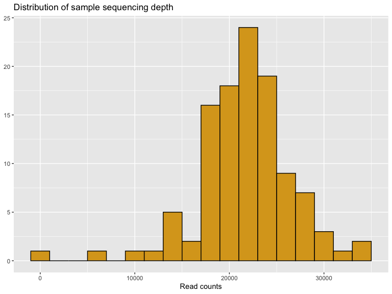
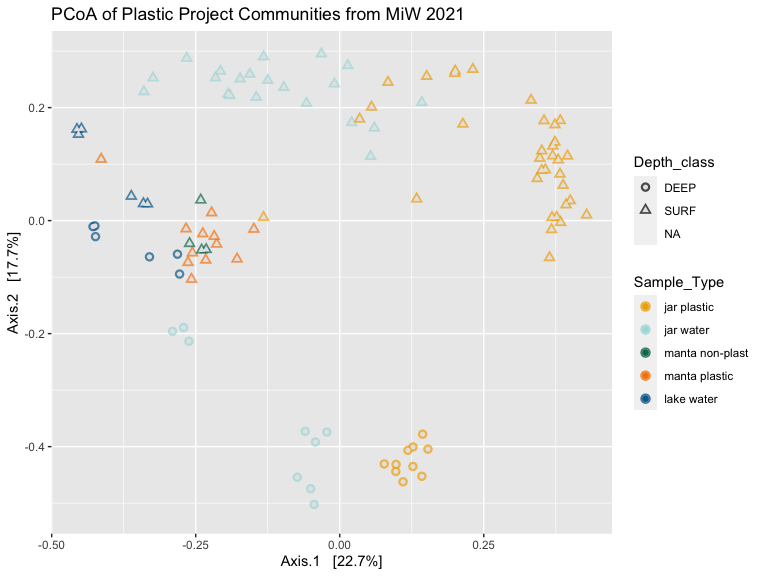
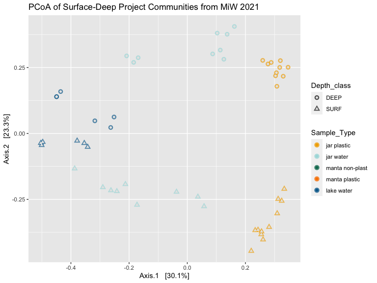
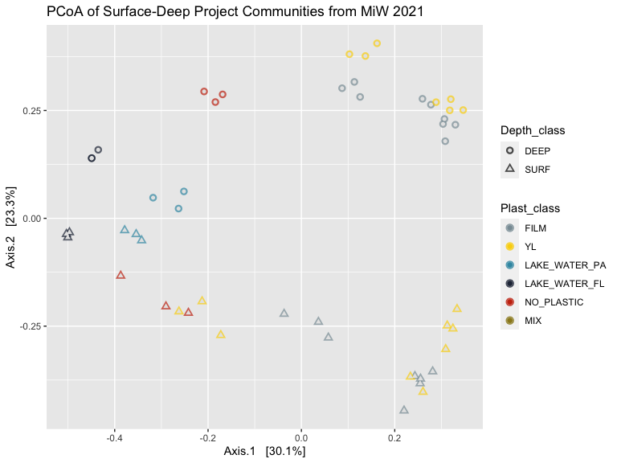
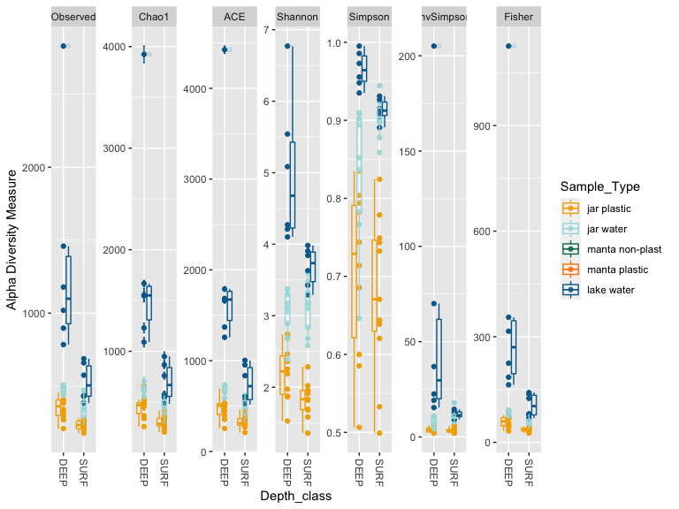

# PART I: Setup and Libraries


```
## Loading required package: knitr
```

Here we will install and load the required packages for our analysis. 


# PART II: Data import and create phyloseq object

There are three files required to create our phyloseq object: 1. the taxonomy file from mothur, 2. the shared file (OTU file) that  connects the OTU counts per sample and 3. the sample metadata file that contains all the other important information describing each sample (group, sample date, sample location, etc.).


# PART III: Cleaning up phyloseq object

## Checking sequencing depth


```
##    Min. 1st Qu.  Median    Mean 3rd Qu.    Max. 
##     277   19778   21952   21727   24625   33911
```




Based on this distribution, we can weed out the samples with only a few reads by pruning those with sequencing depth less than 1000. We can look at the read count table to see the sample ID of the one sample with few reads:


```{=html}
<div id="htmlwidget-d564d18a8eb4e35f9742" style="width:100%;height:auto;" class="datatables html-widget"></div>
<script type="application/json" data-for="htmlwidget-d564d18a8eb4e35f9742">{"x":{"filter":"none","vertical":false,"caption":"<caption>Sum of sequences per sample<\/caption>","data":[["A1","A3","B10","B11","B6","B7","B9","DNA_1","DNA_10","DNA_100","DNA_101","DNA_102","DNA_103","DNA_104","DNA_105","DNA_106","DNA_107","DNA_108","DNA_109","DNA_11","DNA_12","DNA_13","DNA_14","DNA_15","DNA_16","DNA_17","DNA_18","DNA_19","DNA_2","DNA_20a","DNA_22a","DNA_24","DNA_25","DNA_26","DNA_27","DNA_28","DNA_29","DNA_3","DNA_30","DNA_31","DNA_33","DNA_34","DNA_35","DNA_36","DNA_37","DNA_38","DNA_39","DNA_4","DNA_40","DNA_41","DNA_43","DNA_44","DNA_45","DNA_46","DNA_47","DNA_48","DNA_49","DNA_5","DNA_50","DNA_51","DNA_52","DNA_53","DNA_54","DNA_55","DNA_56","DNA_57","DNA_58","DNA_59","DNA_6","DNA_60","DNA_61","DNA_62","DNA_63","DNA_64","DNA_65","DNA_66","DNA_67","DNA_68","DNA_69","DNA_7","DNA_70","DNA_71","DNA_73","DNA_74","DNA_76","DNA_77","DNA_78","DNA_79","DNA_8","DNA_80","DNA_81","DNA_82","DNA_83","DNA_84","DNA_85","DNA_86","DNA_87","DNA_88","DNA_89","DNA_9","DNA_90","DNA_91","DNA_92","DNA_93","DNA_94","DNA_95","DNA_96","DNA_97","DNA_98","DNA_99"],[27793,25679,24571,19819,20335,21157,13187,20783,19944,19765,18033,17081,19848,18172,20868,20486,15922,6399,12780,22475,19837,21832,27045,24235,25099,26291,24668,28730,20511,22435,18636,23399,18421,23675,25724,17515,18283,21097,24166,17783,23784,18199,28493,23925,27877,23500,22635,21153,27945,20270,21636,18534,21991,18725,20701,20061,14575,24643,17159,24310,22598,26328,22200,22598,22634,21217,24725,33911,24849,22016,33455,23490,31607,30189,24144,21930,30357,25262,24647,21435,25296,26053,22083,24240,21279,25513,21581,24768,28974,29468,14169,13440,22878,20242,20915,23675,20225,14464,20401,22495,18933,17311,22193,15888,18549,20538,10617,21973,17396,277]],"container":"<table class=\"display\">\n  <thead>\n    <tr>\n      <th> <\/th>\n      <th>sum<\/th>\n    <\/tr>\n  <\/thead>\n<\/table>","options":{"pageLength":10,"columnDefs":[{"className":"dt-right","targets":1},{"orderable":false,"targets":0}],"order":[],"autoWidth":false,"orderClasses":false}},"evals":[],"jsHooks":[]}</script>
```

From sorting this table by increasing sequence count, we can see that some samples (DNA_99 and DNA_108) had only a few reads. We will remove these (prune) from our data for analysis later on.

##  Prune out low read count samples and mitochondrial reads

We can directly prune our phyloseq object to remove the sample with <1000 sequences. Then we create a new pruned phyloseq object. At the same time, we will remove reads that derive from mitochondrial 16S rRNA gene sequences.


Pruning to remove samples <1000 sequences removed 1 sample.

This is our starting phyloseq object (plast_phylo_pruned).

# Unconstrained Ordinations
One of the best exploratory analyses for amplicon data is unconstrained ordinations. Here we will look at ordinations of the full AvBot community samples, then subset them to explore variation within the experimental data.

To read more about Principle Component Analyses (PCoA), see this great resource for ecological statistics, [GUSTAME PCoA](https://mb3is.megx.net/gustame/dissimilarity-based-methods/principal-coordinates-analysis).



# Create phyloseq objects for different projects


# Surface-Deep Project

Timepoint
Surface or Deep
Plastic class (eg, yellow vs film PE)
Plastic vs water

## Beta-Diversity
### Sample Type and Depth



### Plastic Type



### Permanova
Here is an example of how to run a permanova test using the adonis function in vegan. In this example we are testing the hypothesis that clusters of samples in the plot above that represent the microbes on the plastic film (FILM), yellow (YL) plastic fragments, the jar water, (NO_PLASTIC) and the T0 lake water (both particle-associated and free-living) have different centroids.


```
## $aov.tab
## Permutation: free
## Number of permutations: 999
## 
## Terms added sequentially (first to last)
## 
##                         Df SumsOfSqs MeanSqs F.Model      R2 Pr(>F)    
## Plast_class              4    5.7957 1.44893  16.800 0.39686  0.001 ***
## Depth_class              1    2.9854 2.98540  34.614 0.20443  0.001 ***
## Plast_class:Depth_class  4    2.2865 0.57164   6.628 0.15657  0.001 ***
## Residuals               41    3.5361 0.08625         0.24214           
## Total                   50   14.6038                 1.00000           
## ---
## Signif. codes:  0 '***' 0.001 '**' 0.01 '*' 0.05 '.' 0.1 ' ' 1
## 
## $call
## adonis(formula = sd_phylo_bray ~ Plast_class * Depth_class, data = sd_phylo_bray.df)
## 
## $coefficients
## NULL
## 
## $coef.sites
##                                  [,1]        [,2]        [,3]        [,4]
## (Intercept)                0.74088916  0.74922753  0.73344958  0.74801435
## Plast_class1               0.04984314  0.05190757  0.05976261  0.03841166
## Plast_class2               0.01263539  0.02060071 -0.03364733 -0.03657279
## Plast_class3               0.14796476  0.13469583  0.15331720  0.16101557
## Plast_class4              -0.26013012 -0.25395351 -0.23472132 -0.18861881
## Depth_class1              -0.11157297 -0.11862296 -0.11985164  0.10400876
## Plast_class1:Depth_class1  0.03139082  0.02916604  0.02608673 -0.05041693
## Plast_class2:Depth_class1  0.07018784  0.07717668  0.04675572 -0.04530407
## Plast_class3:Depth_class1  0.10050695  0.10443983  0.10544205 -0.07990853
## Plast_class4:Depth_class1 -0.23652295 -0.24669085 -0.21758538  0.18068189
##                                  [,5]        [,6]        [,7]         [,8]
## (Intercept)                0.74815530  0.73137629  0.78196344  0.775038796
## Plast_class1               0.11991861  0.07013998 -0.23088952 -0.166983850
## Plast_class2              -0.11686747 -0.06654599  0.16573770  0.117082689
## Plast_class3               0.11875504  0.15774702  0.16488103  0.149145815
## Plast_class4              -0.18745792 -0.20439573  0.10302613 -0.016594646
## Depth_class1               0.10410560  0.11630563  0.07729142  0.069737683
## Plast_class1:Depth_class1 -0.09026768 -0.08046887  0.07792419  0.068147628
## Plast_class2:Depth_class1  0.01120916 -0.02710188 -0.06538471 -0.043222909
## Plast_class3:Depth_class1 -0.06611420 -0.08440476 -0.08816148 -0.054941900
## Plast_class4:Depth_class1  0.16608119  0.20735153 -0.03457291 -0.009643637
##                                  [,9]       [,10]       [,11]       [,12]
## (Intercept)                0.79763770  0.79331310  0.80291069  0.76916177
## Plast_class1              -0.24438831 -0.24632954 -0.16499131 -0.23145362
## Plast_class2               0.16265742  0.15849864  0.09847533  0.17195101
## Plast_class3               0.15593743  0.14724887  0.12977466  0.16956657
## Plast_class4               0.08880760  0.08533665 -0.00916257  0.08577616
## Depth_class1               0.07940896  0.07531219  0.05599418  0.08723661
## Plast_class1:Depth_class1  0.11322979  0.10824360  0.09131622  0.09868630
## Plast_class2:Depth_class1 -0.07480052 -0.06698728 -0.03232814 -0.07657736
## Plast_class3:Depth_class1 -0.08065629 -0.09005986 -0.04281441 -0.09062540
## Plast_class4:Depth_class1 -0.02852574 -0.02155710 -0.02931877 -0.04121187
##                                 [,13]        [,14]       [,15]       [,16]
## (Intercept)                0.79910853  0.754011518  0.74912094  0.80260793
## Plast_class1              -0.21288045 -0.128059066 -0.23849012 -0.20301965
## Plast_class2               0.15246030  0.045598199  0.19462807  0.16628179
## Plast_class3               0.14824174  0.158653665  0.18928191  0.15029431
## Plast_class4               0.08033264 -0.022356499  0.10533550  0.09206782
## Depth_class1               0.09592459  0.065493713  0.06187334  0.08815706
## Plast_class1:Depth_class1  0.11395862  0.055879361  0.03253575  0.07917738
## Plast_class2:Depth_class1 -0.08903688 -0.032270569 -0.04373014 -0.08359327
## Plast_class3:Depth_class1 -0.09760141 -0.041515964 -0.05790499 -0.08579119
## Plast_class4:Depth_class1 -0.04401975 -0.003237719 -0.01301521 -0.02760779
##                                 [,17]       [,18]       [,19]       [,20]
## (Intercept)                0.70148967  0.74623203  0.80158873  0.69016883
## Plast_class1              -0.01467525 -0.22726208 -0.18163219  0.03983917
## Plast_class2              -0.05976945  0.19330102  0.14878726 -0.09651572
## Plast_class3               0.17769688  0.18683515  0.14589661  0.16888730
## Plast_class4              -0.05735186  0.09129186  0.08089526 -0.10248197
## Depth_class1               0.10537299  0.05684370  0.07715631  0.10992295
## Plast_class1:Depth_class1 -0.01674027  0.03471140  0.06007355 -0.05586532
## Plast_class2:Depth_class1 -0.02404435 -0.03848171 -0.06515042 -0.00123964
## Plast_class3:Depth_class1 -0.07628005 -0.05661320 -0.07505735 -0.07290194
## Plast_class4:Depth_class1  0.06720410 -0.03585014 -0.03966915  0.09441154
##                                  [,21]       [,22]        [,23]       [,24]
## (Intercept)                0.743147734  0.77114612  0.685757852  0.75880909
## Plast_class1              -0.238801614 -0.21922224  0.007022143 -0.19966834
## Plast_class2               0.193136096  0.18313678 -0.061426627  0.18104242
## Plast_class3               0.186738179  0.17941125  0.160327736  0.17535328
## Plast_class4               0.115848084  0.10154169 -0.076467173  0.03821336
## Depth_class1               0.049014736  0.07058722  0.095032334 -0.09709995
## Plast_class1:Depth_class1  0.014930545  0.03924079 -0.043209803 -0.12276258
## Plast_class2:Depth_class1 -0.029609390 -0.06041154 -0.003328101  0.08713955
## Plast_class3:Depth_class1 -0.046117971 -0.06811618 -0.056516562  0.08653512
## Plast_class4:Depth_class1 -0.008527374 -0.01158165  0.065813175  0.01112549
##                                 [,25]       [,26]       [,27]       [,28]
## (Intercept)                0.74256619  0.70556622  0.72034815  0.76561666
## Plast_class1              -0.23684231 -0.14344708 -0.23398962 -0.21237074
## Plast_class2               0.19996597  0.09032752  0.19816736  0.17904329
## Plast_class3               0.19184232  0.19681590  0.19132783  0.17228393
## Plast_class4               0.08537853 -0.01392375  0.08406110  0.08778161
## Depth_class1              -0.08928462 -0.10707553 -0.09287120 -0.08620850
## Plast_class1:Depth_class1 -0.12325003 -0.09749147 -0.11989349 -0.11531543
## Plast_class2:Depth_class1  0.09974604  0.05591866  0.09264270  0.09881592
## Plast_class3:Depth_class1  0.07100253  0.10145471  0.07410196  0.06584148
## Plast_class4:Depth_class1  0.04573233 -0.03242278  0.03986568  0.04732037
##                                   [,29]       [,30]       [,31]       [,32]
## (Intercept)                0.6801808789  0.70951891  0.76112181  0.67525255
## Plast_class1              -0.1368513215 -0.21333978 -0.23317225 -0.12560565
## Plast_class2               0.0554340750  0.17645190  0.18048738  0.01904332
## Plast_class3               0.2150217435  0.18977653  0.15586894  0.21653020
## Plast_class4               0.0198493718  0.06337568  0.09559859  0.04212251
## Depth_class1              -0.1201006384 -0.11028443 -0.07492019 -0.11162809
## Plast_class1:Depth_class1 -0.1082496747 -0.13400217 -0.11953964 -0.11490326
## Plast_class2:Depth_class1  0.0536924564  0.08929900  0.07830164  0.03316178
## Plast_class3:Depth_class1  0.1089415849  0.09777588  0.04376482  0.10154229
## Plast_class4:Depth_class1 -0.0001855962  0.03048671  0.05004563  0.04109467
##                                 [,33]       [,34]       [,35]       [,36]
## (Intercept)                0.74739370  0.71056678  0.76638182  0.68067237
## Plast_class1              -0.19584319 -0.10055666 -0.20780193 -0.10554648
## Plast_class2               0.19395313  0.06480356  0.20046297  0.04929177
## Plast_class3               0.18539485  0.18833207  0.18351396  0.21121331
## Plast_class4               0.09476047  0.05653245  0.11224017  0.02354760
## Depth_class1              -0.09653811 -0.12882308 -0.09279022 -0.13869789
## Plast_class1:Depth_class1 -0.10482260 -0.09960434 -0.11807374 -0.10618383
## Plast_class2:Depth_class1  0.09677497  0.08254459  0.09513540  0.06741423
## Plast_class3:Depth_class1  0.08755449  0.11885686  0.08909326  0.12857260
## Plast_class4:Depth_class1  0.05987361  0.02466687  0.07911391  0.00696723
##                                  [,37]       [,38]        [,39]        [,40]
## (Intercept)                0.765267451  0.77344916  0.710144656  0.820264523
## Plast_class1              -0.183361336 -0.18902913 -0.118691373  0.112209339
## Plast_class2               0.196747323  0.19825109  0.106457931  0.008073507
## Plast_class3               0.174136576  0.17177194  0.201466721 -0.298385925
## Plast_class4               0.036532965  0.08941896  0.009746679  0.072763820
## Depth_class1              -0.098865787 -0.09727400 -0.145988119 -0.048335330
## Plast_class1:Depth_class1 -0.091919938 -0.10076708 -0.096969974  0.029404795
## Plast_class2:Depth_class1  0.096021391  0.09887622  0.091858197  0.017439707
## Plast_class3:Depth_class1  0.088639236  0.09074177  0.136194090 -0.114171433
## Plast_class4:Depth_class1 -0.002018653  0.05420043 -0.019070756  0.024188607
##                                 [,41]       [,42]       [,43]       [,44]
## (Intercept)                0.86588042  0.80150645  0.74504142  0.73419922
## Plast_class1               0.08267546  0.07437773  0.14520532  0.15254046
## Plast_class2               0.01579498  0.01533302 -0.37027652 -0.38129544
## Plast_class3              -0.23143706 -0.25901030  0.11000651  0.12024340
## Plast_class4               0.05608235  0.07297313 -0.01245603 -0.02153960
## Depth_class1              -0.04624099 -0.05756872 -0.08355554 -0.07281371
## Plast_class1:Depth_class1  0.03482823  0.02609421  0.03675318  0.02838610
## Plast_class2:Depth_class1  0.03550744  0.02145335 -0.17998266 -0.17185103
## Plast_class3:Depth_class1 -0.14648954 -0.11987600  0.04384134  0.03113986
## Plast_class4:Depth_class1  0.03308305  0.02528800  0.03246130  0.04870377
##                                 [,45]       [,46]        [,47]       [,48]
## (Intercept)                0.73672507  0.80642104  0.810756349  0.79462542
## Plast_class1               0.15354031  0.12800369  0.122386699  0.13338317
## Plast_class2              -0.39219510  0.02926806  0.032730813  0.01084806
## Plast_class3               0.12130573 -0.34514059 -0.349039120 -0.32604467
## Plast_class4              -0.01296478  0.07475904  0.085072563  0.06350252
## Depth_class1              -0.07238761  0.07673364  0.076636276  0.07527349
## Plast_class1:Depth_class1  0.02909520 -0.08026179 -0.076880549 -0.07963945
## Plast_class2:Depth_class1 -0.17326852 -0.01009892 -0.003641177 -0.01361870
## Plast_class3:Depth_class1  0.03536267  0.21047904  0.192469479  0.20832976
## Plast_class4:Depth_class1  0.04581418 -0.05769613 -0.051959322 -0.05492208
##                                  [,49]       [,50]       [,51]
## (Intercept)                0.721338673  0.71853373  0.72973884
## Plast_class1               0.174237320  0.16957611  0.17357399
## Plast_class2              -0.363939813 -0.35613240 -0.34957435
## Plast_class3               0.087056335  0.08547045  0.10184325
## Plast_class4              -0.027841636 -0.02380951 -0.05625067
## Depth_class1               0.088372743  0.08588950  0.09431837
## Plast_class1:Depth_class1 -0.094355091 -0.09324380 -0.10141400
## Plast_class2:Depth_class1  0.158359325  0.14123963  0.15791347
## Plast_class3:Depth_class1 -0.035481175 -0.02599501 -0.04648828
## Plast_class4:Depth_class1  0.006002208  0.01284568  0.02994445
## 
## $f.perms
##              [,1]      [,2]      [,3]
##    [1,] 1.1601124 0.8847719 1.2158585
##    [2,] 1.8292102 1.1415529 1.0855032
##    [3,] 1.4116200 0.4911951 0.8618738
##    [4,] 1.1827066 1.9962210 1.4133269
##    [5,] 0.7973270 0.3868811 0.8905232
##    [6,] 0.7236857 0.5510897 0.7788140
##    [7,] 0.9457187 1.0049954 1.0558855
##    [8,] 1.0810400 0.6158388 0.6727745
##    [9,] 0.9951422 2.0748266 1.4501957
##   [10,] 0.9621534 0.4122276 1.3397134
##   [11,] 1.1832451 0.3687683 1.4328441
##   [12,] 1.3883208 2.1805123 1.6446212
##   [13,] 0.9127130 0.9005703 1.1513634
##   [14,] 1.1870632 1.1302541 1.1727509
##   [15,] 1.1520263 0.4463510 0.6897687
##   [16,] 1.1636329 1.3498299 0.8765755
##   [17,] 1.1509857 0.2278438 0.6235665
##   [18,] 1.1218587 0.7358361 0.9075869
##   [19,] 0.7387962 0.2988220 1.1425931
##   [20,] 0.6176418 1.6369603 1.0301365
##   [21,] 0.8467966 0.8963415 0.9030007
##   [22,] 0.6961956 0.1904899 1.3301734
##   [23,] 1.0814233 0.7291358 0.7058843
##   [24,] 1.0766105 0.9444928 0.8953206
##   [25,] 0.7104200 0.7155758 0.8922282
##   [26,] 0.9140565 0.8517157 1.0813695
##   [27,] 0.8809017 1.1339530 0.8308036
##   [28,] 1.0601220 0.8532820 1.1557438
##   [29,] 0.6511079 0.7059632 1.5792823
##   [30,] 0.8119106 0.6190141 1.4100519
##   [31,] 0.9804709 0.7474038 2.4669984
##   [32,] 1.0480957 0.6634998 0.6494397
##   [33,] 0.8652537 0.9933128 0.4431137
##   [34,] 0.8173727 2.0195261 1.1521678
##   [35,] 1.4383124 0.8604260 1.6740382
##   [36,] 1.1629256 0.5054386 0.8861562
##   [37,] 0.6485798 0.5998876 0.9902738
##   [38,] 0.6573520 1.6899893 0.4128847
##   [39,] 0.7317244 0.5778822 1.1909491
##   [40,] 0.9367613 1.0183690 0.5677032
##   [41,] 0.6118539 0.3539543 1.3043895
##   [42,] 0.9822813 0.3162130 0.4168810
##   [43,] 1.6048995 0.9651600 1.1684680
##   [44,] 1.2648598 1.2146311 1.0340806
##   [45,] 0.7280779 1.0741437 1.2804523
##   [46,] 1.0255621 0.9923200 1.1749843
##   [47,] 1.6323984 0.7680589 1.0067217
##   [48,] 0.5114192 0.4879893 0.7548198
##   [49,] 1.0723441 0.6939098 1.0548658
##   [50,] 0.8552692 0.9453984 1.3443579
##   [51,] 0.6237088 0.7348912 0.9198984
##   [52,] 0.6982274 1.3893219 1.1927095
##   [53,] 1.1219029 1.7552939 0.9198204
##   [54,] 1.1710855 0.6587296 0.7425012
##   [55,] 1.1536621 0.7865079 0.7633141
##   [56,] 0.8372417 0.3399718 1.3703480
##   [57,] 1.4658147 0.5521299 0.7486200
##   [58,] 0.7321836 1.0075195 1.6061769
##   [59,] 1.3807911 2.9720248 1.0938373
##   [60,] 1.2758551 0.6283260 0.7348994
##   [61,] 0.6814038 0.9650903 1.3928061
##   [62,] 1.3905330 1.2898069 0.9785991
##   [63,] 1.4806739 0.5986903 0.7535438
##   [64,] 1.0016668 0.6076388 0.4784194
##   [65,] 1.0900323 0.5855240 1.2210698
##   [66,] 0.7385528 0.8894826 1.0601228
##   [67,] 1.1300408 1.1194751 0.9531880
##   [68,] 1.0709445 1.1005269 1.4503300
##   [69,] 0.9606047 0.6315569 0.7656978
##   [70,] 1.4244514 0.5193119 0.8593546
##   [71,] 0.5356392 1.8402296 0.9299649
##   [72,] 0.7438711 0.8454691 0.9274091
##   [73,] 0.7298077 0.5659191 0.8711211
##   [74,] 1.2520979 0.5416036 0.8099988
##   [75,] 0.7067253 1.2977731 1.3219153
##   [76,] 1.0858110 0.3909534 1.1940010
##   [77,] 0.6787698 0.8716348 0.7843504
##   [78,] 0.6604594 0.3845986 1.1909576
##   [79,] 1.0389199 1.1303259 1.0710655
##   [80,] 0.7757309 1.4914390 1.4244749
##   [81,] 0.9761468 0.4678433 1.2620842
##   [82,] 0.7106764 0.9192310 1.0669294
##   [83,] 0.6380849 0.6753175 1.2818539
##   [84,] 0.8083468 1.3829513 0.8318477
##   [85,] 0.6866834 0.9529984 1.3536352
##   [86,] 1.1727724 0.3028373 0.8772179
##   [87,] 1.3087989 1.9505840 0.3370703
##   [88,] 1.0612207 1.7129057 0.5726442
##   [89,] 0.6651543 0.8911827 1.2355666
##   [90,] 0.9869867 2.1227541 1.3032774
##   [91,] 1.4321285 1.3793900 1.1609699
##   [92,] 1.0764106 0.5366647 1.1025720
##   [93,] 0.7252508 0.4425195 0.8835732
##   [94,] 1.0640715 0.8929002 1.1186401
##   [95,] 1.1801566 1.1254869 0.7823339
##   [96,] 1.0295750 0.7947898 1.1148841
##   [97,] 0.8505436 1.6881816 0.7034495
##   [98,] 0.8764775 1.1819288 0.5348855
##   [99,] 0.8599793 1.1389858 1.3369228
##  [100,] 1.1519443 1.2397790 1.3919933
##  [101,] 0.9233397 0.6256694 0.8566242
##  [102,] 1.2000015 0.5143811 0.6903747
##  [103,] 0.8695507 2.3937968 0.9644884
##  [104,] 0.7464391 0.7860832 1.0609807
##  [105,] 0.8629566 1.6769413 1.0855515
##  [106,] 1.1828050 0.7377750 0.9750872
##  [107,] 0.9075664 1.0980900 0.6819409
##  [108,] 0.8574440 1.3164499 0.8443307
##  [109,] 0.7582047 0.7303803 1.3352250
##  [110,] 1.2698159 0.8968230 1.0374590
##  [111,] 0.8793357 1.4818147 1.0093984
##  [112,] 0.7469181 2.3232032 1.2641972
##  [113,] 0.8227728 1.5292738 0.9909477
##  [114,] 1.1916850 0.9758143 1.1203657
##  [115,] 1.0143716 0.3200652 0.8987425
##  [116,] 1.2017618 0.9448368 1.9711750
##  [117,] 1.1818239 1.2399779 0.7443971
##  [118,] 1.2667426 1.0412907 1.1638803
##  [119,] 0.9497420 1.3845341 0.9761893
##  [120,] 2.0370261 0.9191457 0.7022261
##  [121,] 0.9380203 0.7106001 1.3499040
##  [122,] 0.8710588 2.1330749 0.5843537
##  [123,] 0.5916890 0.7077735 0.7658046
##  [124,] 1.5698372 1.4349417 1.0411768
##  [125,] 1.1145796 1.7442944 1.2366375
##  [126,] 0.9401518 2.0426573 0.9770528
##  [127,] 0.7257541 0.7880154 0.8041877
##  [128,] 1.4361371 0.4708332 1.3150856
##  [129,] 0.6440257 0.5384736 1.0082732
##  [130,] 0.8478677 1.8386219 1.2082297
##  [131,] 1.2138584 0.8401660 1.4971565
##  [132,] 1.6817147 1.0295463 0.7471035
##  [133,] 0.8164080 0.6272319 1.2106165
##  [134,] 0.7793819 0.7188608 1.4370819
##  [135,] 1.3185108 0.6332209 1.3117474
##  [136,] 0.4924830 1.2690893 0.9853985
##  [137,] 0.9402156 0.3879149 1.0453902
##  [138,] 1.1640659 1.2077926 1.0540508
##  [139,] 0.8581530 1.0431302 1.3496690
##  [140,] 1.0513860 0.8094183 1.2485469
##  [141,] 1.3138060 0.7620696 0.9332577
##  [142,] 1.2321563 0.4396899 0.9888296
##  [143,] 1.1477451 0.9606642 1.1756863
##  [144,] 0.9712785 1.3916024 0.7373203
##  [145,] 0.9956844 1.5856004 0.9194028
##  [146,] 0.5554772 1.0850098 0.8787313
##  [147,] 1.4010424 0.9028224 1.5120403
##  [148,] 0.8821930 0.8239027 1.2113246
##  [149,] 1.2510954 2.0142439 0.8636585
##  [150,] 0.7798082 0.4270363 0.9409856
##  [151,] 1.4189131 0.7570094 1.5240004
##  [152,] 0.8888226 1.4781742 1.0060747
##  [153,] 0.8957733 0.4343241 0.6340549
##  [154,] 0.6288374 0.6759735 0.9047066
##  [155,] 0.9417196 0.7567611 1.2971344
##  [156,] 1.1647234 1.2646160 0.6789944
##  [157,] 0.9411151 0.2386623 0.6282028
##  [158,] 0.7823734 0.3856969 1.4630020
##  [159,] 1.2532880 0.5572278 1.4757034
##  [160,] 1.4143572 2.4647169 1.8971523
##  [161,] 0.9721626 0.9939256 1.7319730
##  [162,] 1.2796853 1.1778229 0.6014281
##  [163,] 0.6163729 1.1212904 0.7087214
##  [164,] 0.8020021 0.8513105 0.6679610
##  [165,] 0.8702560 0.7600349 1.2190798
##  [166,] 0.8738436 0.5714411 0.5566527
##  [167,] 1.0031543 0.8319049 1.1011539
##  [168,] 1.3005558 0.4680611 1.5505811
##  [169,] 1.3967177 1.4957547 0.9690604
##  [170,] 0.9160267 0.9482155 0.8955321
##  [171,] 0.8521159 0.7384062 0.9295099
##  [172,] 0.9550462 0.4417567 0.6904600
##  [173,] 1.3675495 2.0755508 1.0302433
##  [174,] 0.6911381 0.9338748 0.9990231
##  [175,] 0.8238979 1.2170704 1.3303186
##  [176,] 0.9012957 0.4665543 0.7057797
##  [177,] 0.8729225 2.5727375 1.0586586
##  [178,] 0.8731068 1.5073212 0.8821334
##  [179,] 1.5284129 0.9402875 1.3846952
##  [180,] 1.4732724 0.8545546 1.1092660
##  [181,] 0.5839994 0.7160042 0.9825208
##  [182,] 0.9488607 0.8200137 1.0974455
##  [183,] 0.5753755 0.5826184 0.9561985
##  [184,] 0.6766330 0.7094815 0.6912334
##  [185,] 1.1238425 0.6931823 1.0826602
##  [186,] 0.9157997 0.5923801 0.8564527
##  [187,] 2.0001543 0.5454040 1.0162298
##  [188,] 0.8547503 0.9973177 1.1302878
##  [189,] 0.6646415 0.9059745 1.0586843
##  [190,] 0.7905454 0.8849230 1.2434414
##  [191,] 0.9703714 0.7687509 0.8336429
##  [192,] 0.8191490 1.2026161 0.8348297
##  [193,] 0.8873979 1.3214580 1.2454002
##  [194,] 1.0937434 1.4395672 0.7968607
##  [195,] 1.1718690 0.3674705 1.1406548
##  [196,] 1.3634816 0.5959696 0.9916290
##  [197,] 0.9450374 1.2469574 1.2046930
##  [198,] 0.8905803 1.2072518 0.9449646
##  [199,] 0.8780449 0.5356023 0.7115199
##  [200,] 0.7474809 0.5164895 0.9213262
##  [201,] 1.2552796 0.9864287 0.7524169
##  [202,] 0.9398902 0.7665796 1.0573772
##  [203,] 0.7240564 0.6692712 1.3322236
##  [204,] 0.6008496 1.2311729 1.2158255
##  [205,] 0.7632404 1.0845415 0.6825229
##  [206,] 1.1642498 0.4184485 0.9882215
##  [207,] 0.9452430 1.3647346 0.9371931
##  [208,] 1.0608362 0.8384011 1.3556678
##  [209,] 0.9304903 0.9209218 0.9560697
##  [210,] 1.0555233 0.9660373 1.2099062
##  [211,] 0.8156942 1.5777613 0.8271118
##  [212,] 0.9790654 0.3936068 0.9700862
##  [213,] 0.9566157 0.8024371 0.8348797
##  [214,] 0.7160195 0.6989662 0.7988726
##  [215,] 1.6594028 0.8798054 1.5126441
##  [216,] 0.7626056 0.6433889 1.0304319
##  [217,] 1.1285128 0.9444569 1.5405902
##  [218,] 0.9073357 0.7888466 0.7910487
##  [219,] 1.3433159 0.6682672 0.8910996
##  [220,] 1.1269496 2.4762544 1.1933356
##  [221,] 0.9236515 0.5130094 0.9865729
##  [222,] 1.1146239 1.1940068 1.0413023
##  [223,] 1.6109395 1.8841176 0.7891616
##  [224,] 1.0287639 0.8866234 0.7493333
##  [225,] 0.5452282 2.0371276 0.8496794
##  [226,] 0.7664300 1.8370357 0.8533005
##  [227,] 1.2801792 0.8365425 1.3374916
##  [228,] 0.6988753 1.8926977 1.1600796
##  [229,] 0.5868004 0.7517006 1.0833792
##  [230,] 0.8940442 0.6492386 0.9349125
##  [231,] 1.0315103 0.7579192 1.2612577
##  [232,] 0.7238116 1.2184565 0.8258387
##  [233,] 0.7578118 2.1395661 1.0268921
##  [234,] 1.0814334 0.4753326 0.9261097
##  [235,] 1.3855212 1.6236146 1.5771283
##  [236,] 0.9024785 1.2530292 0.6108165
##  [237,] 0.6976358 0.7320783 1.1863026
##  [238,] 0.6601136 0.6056445 0.9455532
##  [239,] 0.8868188 1.3759905 1.1070733
##  [240,] 1.2692649 0.5763353 0.9784524
##  [241,] 1.4246283 1.5620064 1.6971678
##  [242,] 0.6403044 0.4549522 1.0178866
##  [243,] 0.8727259 1.8831799 1.1787521
##  [244,] 1.0551195 1.0282936 0.9084193
##  [245,] 0.9453922 1.1086433 1.1739787
##  [246,] 1.2941760 0.9332230 0.7855884
##  [247,] 0.6127560 0.9273609 1.1986548
##  [248,] 0.5909868 2.1413907 0.8410558
##  [249,] 0.7853162 0.9570155 0.5925961
##  [250,] 1.4275190 0.7609917 0.8496108
##  [251,] 0.6252741 0.3895790 1.2532854
##  [252,] 1.0206392 0.4706322 1.2552910
##  [253,] 1.0029315 0.4864359 0.7171074
##  [254,] 1.6283352 1.1130173 1.4014216
##  [255,] 1.0009742 0.5028742 0.9395839
##  [256,] 1.9388100 0.7105769 1.3416127
##  [257,] 0.6736714 1.1923413 0.7697965
##  [258,] 1.0862852 0.9350510 0.7684494
##  [259,] 1.2403127 1.7139512 0.5598697
##  [260,] 1.0056522 0.6766519 0.6378259
##  [261,] 0.6207857 2.0540850 1.1000004
##  [262,] 0.9084980 0.5826441 1.7964848
##  [263,] 1.5516455 0.3031869 0.7345225
##  [264,] 0.5092920 0.9118416 1.6089477
##  [265,] 0.6335712 0.9023130 0.9599666
##  [266,] 0.7550015 0.5856315 0.9414577
##  [267,] 1.5281507 0.5437486 1.0029201
##  [268,] 1.1219674 0.7019294 1.6443038
##  [269,] 1.1823419 1.3457726 1.6880398
##  [270,] 1.0295899 2.8769056 0.9262551
##  [271,] 1.2100466 3.2770317 1.0383050
##  [272,] 1.0016672 0.3377387 0.6406743
##  [273,] 1.3839191 2.2830189 1.4292913
##  [274,] 0.7879848 0.6334015 1.1290675
##  [275,] 1.0454175 1.1141707 0.9425743
##  [276,] 1.0607267 3.1163880 0.9731601
##  [277,] 1.2057259 3.3897180 0.9597678
##  [278,] 1.3435711 2.8770090 0.7951694
##  [279,] 1.0495806 2.7162642 1.3855965
##  [280,] 0.9733478 0.9801190 0.9683497
##  [281,] 1.0716883 1.0034015 0.8318155
##  [282,] 1.1738213 0.5111975 1.2756195
##  [283,] 1.3259669 0.4196274 0.9972446
##  [284,] 1.1368121 3.4423791 0.9489511
##  [285,] 0.7987777 1.9819763 1.0197127
##  [286,] 0.9222663 2.5671824 1.1723733
##  [287,] 0.6932424 0.6175550 0.7875514
##  [288,] 0.7782542 0.8794868 0.7233945
##  [289,] 1.2548135 1.6217194 0.8088093
##  [290,] 0.8769261 1.4479824 0.7830301
##  [291,] 0.6184439 1.3833186 0.6860750
##  [292,] 1.0844956 0.7265016 0.7821699
##  [293,] 1.0534229 0.8711028 0.7915370
##  [294,] 0.7783766 1.6792745 1.7412168
##  [295,] 1.0641088 1.7050382 0.8355596
##  [296,] 1.4712300 1.4735505 1.1571912
##  [297,] 1.0312675 0.5164425 1.1713370
##  [298,] 0.9428905 0.8644001 0.7473397
##  [299,] 0.8845527 0.6983970 1.0642344
##  [300,] 0.7389339 1.2963388 0.5770545
##  [301,] 1.0146443 0.3378664 0.9509022
##  [302,] 0.7368413 1.0770135 0.5957774
##  [303,] 0.9498199 0.6585590 0.9192187
##  [304,] 0.7342479 1.6258140 1.0528151
##  [305,] 0.8035608 1.4619585 0.6393855
##  [306,] 1.2233192 0.4427599 1.2508025
##  [307,] 0.7774828 2.6901981 0.6600232
##  [308,] 0.8833617 0.7576574 0.9653009
##  [309,] 0.9941592 0.2579496 1.6235582
##  [310,] 0.8568401 0.3317863 0.7779776
##  [311,] 1.0759782 0.6226008 0.6921538
##  [312,] 0.6436670 0.9599466 0.9226339
##  [313,] 0.5739266 0.6144675 1.1200642
##  [314,] 2.1000118 1.0403170 1.5522443
##  [315,] 1.0879478 0.2727036 0.8352020
##  [316,] 1.3272080 1.2749722 0.9290193
##  [317,] 1.3622931 1.2896682 0.6732010
##  [318,] 0.7403659 0.5212436 0.8430109
##  [319,] 0.8797566 1.5415688 1.8196700
##  [320,] 1.4398689 0.3142656 1.2648579
##  [321,] 1.5001732 0.5237268 1.0888652
##  [322,] 1.0058726 0.6201667 1.0060604
##  [323,] 1.4704307 2.0068688 1.3551435
##  [324,] 0.7283719 0.3012429 1.2569215
##  [325,] 0.5758811 0.5669922 1.0004745
##  [326,] 0.8077647 0.2811492 1.0243911
##  [327,] 1.1439276 0.7487971 1.3103508
##  [328,] 1.0241688 1.1555345 0.6825086
##  [329,] 0.9746232 1.4917390 0.8192104
##  [330,] 0.8997786 1.0499311 0.7442125
##  [331,] 1.4457774 1.4722138 0.7870127
##  [332,] 0.9588258 0.2521548 1.0053444
##  [333,] 1.0389832 1.6213300 1.8856126
##  [334,] 0.9717003 1.5423713 1.1615997
##  [335,] 1.2827689 0.3763235 0.9800628
##  [336,] 0.5025713 1.3933426 0.9007845
##  [337,] 0.9023892 1.0584956 0.8901663
##  [338,] 0.9097341 0.3986166 0.9715870
##  [339,] 1.2472214 1.1626355 0.9472504
##  [340,] 1.1349661 0.3046607 0.8518056
##  [341,] 1.2843525 0.9449004 0.7267010
##  [342,] 0.8100798 0.7692545 1.0298963
##  [343,] 0.7727726 0.7134310 1.5134635
##  [344,] 0.8959463 1.2649566 0.5623515
##  [345,] 0.8935196 0.5104062 0.7657736
##  [346,] 0.5696075 0.8349320 0.7462074
##  [347,] 0.8968843 1.1515525 0.5514312
##  [348,] 1.5763046 1.0820809 0.9645849
##  [349,] 0.7010244 0.7272223 1.7343960
##  [350,] 0.7179524 0.3586857 0.5903279
##  [351,] 1.0497421 0.5417354 1.3111781
##  [352,] 0.7846451 2.3428973 1.0320765
##  [353,] 0.7557637 0.9940588 1.1007219
##  [354,] 1.0163994 0.7881247 1.1032825
##  [355,] 0.7699757 0.6599933 0.7537183
##  [356,] 0.7339913 1.1161621 0.9641924
##  [357,] 1.0553095 0.8462651 0.7707686
##  [358,] 1.0653425 0.6416227 0.5617024
##  [359,] 1.1216040 1.5276301 0.8451343
##  [360,] 0.8620686 0.6807129 0.7643065
##  [361,] 0.8735943 1.0859141 1.6475459
##  [362,] 0.9407164 1.0004548 0.8942096
##  [363,] 0.7177637 0.7838190 0.6377882
##  [364,] 0.7339309 1.4030973 1.6380181
##  [365,] 0.8274618 0.8701739 1.2219393
##  [366,] 0.9136823 2.0996494 1.1952247
##  [367,] 0.4570397 1.4462432 0.8572162
##  [368,] 1.6839066 1.1768150 1.2215937
##  [369,] 1.2386585 0.6948192 1.0874897
##  [370,] 0.7059611 0.8999037 0.8666879
##  [371,] 1.2082702 0.8748606 0.6408812
##  [372,] 0.8090250 0.9852129 1.3748172
##  [373,] 1.0880614 0.6385352 1.4427118
##  [374,] 0.7424016 0.5757009 0.7321538
##  [375,] 1.0572855 0.7594639 0.7952870
##  [376,] 0.8637203 0.9186927 1.2348145
##  [377,] 1.1544228 1.9160727 1.1595432
##  [378,] 1.3183787 0.6001347 0.9827220
##  [379,] 0.7769712 1.1585066 0.8474618
##  [380,] 0.9265434 0.8593224 1.1231699
##  [381,] 0.8936093 1.0572308 0.8572068
##  [382,] 1.1546579 0.8082957 1.2157215
##  [383,] 1.3749299 0.9435274 1.2294593
##  [384,] 0.6687191 0.3762313 0.7435857
##  [385,] 0.7921998 1.1999328 1.4418479
##  [386,] 0.9189426 0.5359033 0.6285513
##  [387,] 0.9322560 0.3017394 1.1676980
##  [388,] 1.2029152 0.6380257 1.1138770
##  [389,] 1.4567438 1.2582311 0.8895239
##  [390,] 0.8069245 1.3858500 0.9132264
##  [391,] 0.8824606 0.7634448 0.6032591
##  [392,] 0.7717648 0.7940440 0.5784401
##  [393,] 0.7342915 0.7614116 0.9141457
##  [394,] 1.5417289 1.0655008 0.8605505
##  [395,] 1.8396049 0.5146696 0.8453739
##  [396,] 1.2383274 1.3730097 0.9545393
##  [397,] 1.4998351 1.6260395 1.0126653
##  [398,] 1.2307001 2.4706959 1.1026363
##  [399,] 0.9356903 1.1988755 1.1122098
##  [400,] 0.8122263 0.9892165 0.9145212
##  [401,] 0.8400815 1.1734546 1.3037903
##  [402,] 0.8679961 0.3667707 0.7522952
##  [403,] 0.9095436 0.6037229 1.1404017
##  [404,] 0.5328410 0.6557029 0.8164675
##  [405,] 0.9149623 1.5699974 1.4623956
##  [406,] 1.3114338 0.9497631 0.8157656
##  [407,] 0.6981892 0.4894648 0.7354607
##  [408,] 1.1422710 1.0057051 0.5282230
##  [409,] 1.3372672 0.3516606 0.9010674
##  [410,] 1.0127824 0.7192865 0.6802542
##  [411,] 0.6676057 0.8799239 1.0505586
##  [412,] 1.1894005 1.3530314 0.7760258
##  [413,] 0.8689465 1.0860462 1.3095556
##  [414,] 0.7659995 0.6575408 1.2208355
##  [415,] 0.7732410 2.5233106 0.9985335
##  [416,] 0.9138109 0.8637008 1.1730744
##  [417,] 0.9539050 0.3931509 0.8668520
##  [418,] 0.7055421 0.5329505 0.7300561
##  [419,] 1.2528882 0.5454086 1.6566737
##  [420,] 0.5395787 0.6324387 0.5688468
##  [421,] 1.5172600 1.4087372 0.9898067
##  [422,] 0.6165500 0.6927818 1.2603046
##  [423,] 0.7336921 0.9783873 0.7203901
##  [424,] 0.7884623 3.2483077 0.8084499
##  [425,] 1.4972378 1.0011946 0.8915275
##  [426,] 0.9955063 0.7321609 0.6721758
##  [427,] 0.9792597 1.8958129 1.2233980
##  [428,] 0.9962149 0.7356211 1.5018106
##  [429,] 0.8216323 0.8537975 0.6350094
##  [430,] 0.8743940 0.5867923 0.8226037
##  [431,] 0.5118949 0.6532806 0.9405495
##  [432,] 0.6872992 0.9238167 1.1850019
##  [433,] 0.5823540 0.3444351 1.1956919
##  [434,] 1.0306659 0.3519284 0.7425865
##  [435,] 1.5494892 0.4149195 0.5839081
##  [436,] 1.1579648 0.8087599 0.9134213
##  [437,] 0.9212147 0.3668424 0.6557826
##  [438,] 0.7602523 0.7563505 0.7082991
##  [439,] 1.8574253 0.7402443 0.7899587
##  [440,] 0.7515149 0.8074533 0.7627083
##  [441,] 1.3034176 1.0628746 1.0552566
##  [442,] 1.4213770 0.4115157 0.6654584
##  [443,] 0.8686175 1.2068860 1.7517614
##  [444,] 1.2087305 0.7561283 1.0789866
##  [445,] 1.4898380 1.4073785 1.2139761
##  [446,] 0.8304060 0.4834887 0.8733846
##  [447,] 1.3622436 0.5169333 0.9566938
##  [448,] 0.6972683 0.7155462 0.9660096
##  [449,] 1.0107181 0.7765218 1.0960161
##  [450,] 1.8574917 0.9158507 1.2741338
##  [451,] 1.2578430 0.8348245 0.8378102
##  [452,] 0.8659169 1.0330262 0.6745729
##  [453,] 0.9081459 2.1785958 0.9666822
##  [454,] 0.9606847 0.7493188 1.4565952
##  [455,] 1.2515568 0.7948446 0.5092251
##  [456,] 0.9284873 2.6897740 0.9455036
##  [457,] 0.9463763 0.5327073 1.0622713
##  [458,] 0.8879374 0.4736656 0.5850150
##  [459,] 0.5462413 1.4200607 0.8138474
##  [460,] 0.9865054 0.8242765 1.8508378
##  [461,] 1.0230424 1.4251861 0.7974528
##  [462,] 1.2220150 0.8353707 0.9905275
##  [463,] 0.8707251 1.8892681 1.0842743
##  [464,] 1.6605662 0.4851678 0.8601722
##  [465,] 0.8302857 0.8092296 1.2675520
##  [466,] 0.5195500 1.3223328 0.9068782
##  [467,] 0.9697950 1.7555552 1.1961706
##  [468,] 1.0258697 0.3116914 1.0216731
##  [469,] 1.7621436 1.2772649 0.6636886
##  [470,] 1.3732869 0.3403808 1.0237724
##  [471,] 1.2445331 0.7092265 0.9155076
##  [472,] 0.5426160 0.4445514 1.0469787
##  [473,] 1.2538279 0.7816622 0.9408814
##  [474,] 1.1121980 0.3931258 0.9212801
##  [475,] 0.8180824 1.2934469 1.0720457
##  [476,] 0.5997334 0.8393420 1.1346687
##  [477,] 1.0843134 0.5227652 1.1970211
##  [478,] 0.9923302 1.7907652 1.2924225
##  [479,] 0.8715124 1.1120771 1.3612663
##  [480,] 0.7116307 0.8029902 0.6966098
##  [481,] 1.2778997 1.6830017 0.9991465
##  [482,] 1.2045982 1.5343113 0.5057766
##  [483,] 1.0857356 0.8287802 0.8218875
##  [484,] 1.4198370 0.8721007 1.4166067
##  [485,] 1.0887250 1.2014986 1.5917079
##  [486,] 1.0538472 2.8496609 0.8755407
##  [487,] 0.8311320 1.2108939 0.9656138
##  [488,] 1.4370586 2.0978677 1.5352469
##  [489,] 0.9463696 1.8054835 1.0364107
##  [490,] 1.2248861 1.0738560 1.1178609
##  [491,] 1.0878445 2.2385654 1.8729638
##  [492,] 1.5930725 0.9313524 0.7632452
##  [493,] 1.0162046 0.6352539 0.6367003
##  [494,] 0.9028001 1.3471595 1.0113762
##  [495,] 0.8300791 0.7087782 0.9359483
##  [496,] 0.5878120 0.8486533 0.5684582
##  [497,] 1.2971005 0.6000467 1.3483050
##  [498,] 1.2003149 0.3341559 0.8270649
##  [499,] 1.1163505 1.4081321 0.8940317
##  [500,] 1.1198511 0.6421345 0.7245994
##  [501,] 0.7196228 0.2924747 0.6157349
##  [502,] 1.0852141 0.5737742 0.8089886
##  [503,] 0.8225590 1.2560541 0.8173797
##  [504,] 0.7688987 1.3055864 0.6693350
##  [505,] 1.2732131 1.3212136 0.9265084
##  [506,] 1.0767619 1.0577862 0.6334475
##  [507,] 1.2294299 0.6930892 1.1037263
##  [508,] 0.9747617 0.8011916 0.9833000
##  [509,] 0.7759700 0.4464907 0.7747785
##  [510,] 1.0550529 1.4556086 0.7875238
##  [511,] 0.6518245 0.7605735 1.0592069
##  [512,] 1.0912469 0.5785002 1.0419985
##  [513,] 0.9794122 1.8609883 1.7049307
##  [514,] 0.9987819 0.4175824 0.6571494
##  [515,] 1.0902087 0.3762326 1.9008042
##  [516,] 1.3947614 1.7425155 0.7101877
##  [517,] 0.6028156 0.3524180 0.8030895
##  [518,] 0.9747357 1.0118204 1.2937114
##  [519,] 0.8946378 0.4959520 0.7875014
##  [520,] 0.8627709 0.6510488 0.9913266
##  [521,] 0.6759383 0.5349947 0.7437535
##  [522,] 0.6878007 0.8061460 1.1754364
##  [523,] 0.6757443 0.7250721 0.9206126
##  [524,] 1.1279614 0.4432832 0.8283415
##  [525,] 0.6585154 0.4948054 0.9251062
##  [526,] 1.1501623 0.4917807 1.0999326
##  [527,] 1.2696743 1.2248564 0.6563372
##  [528,] 0.8783249 0.6880715 0.5429035
##  [529,] 1.3273307 2.0431219 0.8774069
##  [530,] 1.7562839 1.2303718 1.6250686
##  [531,] 0.7291018 0.6756472 1.2084217
##  [532,] 0.8417896 0.3107817 0.7889755
##  [533,] 0.7787304 1.2754802 0.6971563
##  [534,] 0.8735003 0.8382461 1.3086465
##  [535,] 1.3572061 0.6939081 0.6834048
##  [536,] 0.5361115 0.7250015 1.3153680
##  [537,] 0.8736811 0.6211847 0.6630213
##  [538,] 0.7718895 0.6940149 1.4649596
##  [539,] 1.2667823 0.5214081 0.7223170
##  [540,] 0.8847228 0.8828634 1.1051842
##  [541,] 0.8899909 0.2981062 0.8196099
##  [542,] 1.5829398 0.9025569 1.0896791
##  [543,] 0.9213172 1.0151396 0.7077653
##  [544,] 1.4390399 0.2940873 1.3745995
##  [545,] 0.8546770 0.6224254 0.5816843
##  [546,] 0.8382668 0.8281771 0.6712212
##  [547,] 0.7681518 0.9604864 0.9622544
##  [548,] 0.7852242 0.4754703 1.1542521
##  [549,] 1.2784615 1.0358597 1.6807061
##  [550,] 0.6262849 0.7937091 0.9463831
##  [551,] 1.0654250 0.5429799 0.9740068
##  [552,] 1.1443083 1.6756345 0.7041552
##  [553,] 1.0064544 0.5784008 1.2228827
##  [554,] 1.8096367 1.4897137 0.6580381
##  [555,] 1.2671897 0.2458865 0.9219053
##  [556,] 1.2477795 1.1583895 0.8098629
##  [557,] 1.0412376 1.2610877 1.0896337
##  [558,] 0.7899259 3.2324447 0.7688902
##  [559,] 0.8796095 0.5501458 1.0300463
##  [560,] 0.6485002 1.8523212 0.9236893
##  [561,] 0.8782652 0.6062537 0.9074548
##  [562,] 1.8304289 1.1934420 1.1416322
##  [563,] 0.6543970 1.1909774 1.1129283
##  [564,] 0.9945610 0.3715653 1.1244835
##  [565,] 1.0219061 0.9612842 0.9473167
##  [566,] 0.7086945 0.6678947 1.1059512
##  [567,] 0.5551671 0.6375502 1.0654143
##  [568,] 0.9703657 0.6922071 0.9452964
##  [569,] 1.1003728 0.5672173 1.0528595
##  [570,] 1.3001576 1.2050072 1.0550423
##  [571,] 1.1749796 0.6501972 1.0764055
##  [572,] 0.6570784 0.5037906 0.8278459
##  [573,] 0.8559412 0.7233134 0.6110427
##  [574,] 1.0095772 0.6243901 1.2997517
##  [575,] 0.6896188 0.7193711 0.8112423
##  [576,] 0.6896871 0.6630571 1.8180849
##  [577,] 0.7037462 0.9050158 0.9088763
##  [578,] 0.7681332 0.8182856 0.8934507
##  [579,] 1.1604013 0.9198144 0.9667794
##  [580,] 0.7841641 1.0044514 0.6992365
##  [581,] 0.7644088 0.4328047 0.7495105
##  [582,] 0.6672923 0.7491416 1.4632554
##  [583,] 1.0262193 1.1222573 1.0480566
##  [584,] 0.7204240 0.6458421 0.9992929
##  [585,] 0.9789713 0.9386087 0.5330846
##  [586,] 0.7908817 0.5158115 1.1206415
##  [587,] 0.8435406 2.3017016 0.6721350
##  [588,] 0.9587462 1.2757217 1.1958192
##  [589,] 0.8800651 0.9177872 0.9649976
##  [590,] 0.7369755 0.8177577 1.0142405
##  [591,] 0.9223596 0.3838446 1.4163644
##  [592,] 0.8807805 2.1297131 1.2198889
##  [593,] 0.8053311 0.9214803 1.5846339
##  [594,] 1.4174840 1.0086224 1.3269170
##  [595,] 1.0207763 1.2076057 1.7068121
##  [596,] 0.8963052 1.0875603 1.0842272
##  [597,] 1.0270218 0.7423659 0.8392717
##  [598,] 1.0718982 2.3137674 0.7185872
##  [599,] 1.2841664 1.8824081 1.0052166
##  [600,] 1.8348153 1.2037458 1.1468953
##  [601,] 0.8716128 1.0743488 1.0315078
##  [602,] 0.7289099 0.2230995 0.9904849
##  [603,] 0.6856768 1.4827492 0.9656655
##  [604,] 0.5940029 0.5193773 0.7270820
##  [605,] 0.6599229 0.7922530 0.6513131
##  [606,] 0.9683293 1.2612270 0.9640322
##  [607,] 0.7077372 0.4584233 0.9719637
##  [608,] 0.7941842 0.3674752 0.7744840
##  [609,] 1.6038260 0.7957805 0.9033325
##  [610,] 0.9037176 0.9503096 0.5352594
##  [611,] 0.9543587 1.1223607 0.7833173
##  [612,] 0.7200141 1.4056795 0.7505695
##  [613,] 1.8647132 0.5730517 1.0768364
##  [614,] 1.0035519 0.6710367 1.2402204
##  [615,] 1.1492079 1.4228276 0.9811229
##  [616,] 0.9477635 0.8556350 0.9102776
##  [617,] 0.8980008 2.3975232 1.2859427
##  [618,] 1.1149868 2.2992932 1.0199391
##  [619,] 1.5829777 1.0975542 0.6664674
##  [620,] 1.1831227 1.0353231 1.1703027
##  [621,] 0.7146184 0.7581466 0.8095905
##  [622,] 1.0359369 0.5271118 1.1567817
##  [623,] 1.1765799 0.6143182 0.5887057
##  [624,] 1.1082702 0.4227414 0.6106875
##  [625,] 1.0712689 0.6101760 1.0004188
##  [626,] 0.9877919 0.8726273 0.6895814
##  [627,] 0.9698428 1.5702197 1.5059313
##  [628,] 1.2659681 0.7676960 1.3093834
##  [629,] 0.8540052 1.6507696 0.6890171
##  [630,] 0.9012216 0.5603905 0.9128120
##  [631,] 1.1887143 1.1738976 0.9699026
##  [632,] 0.8726427 0.4437769 0.7262278
##  [633,] 1.6407213 1.5414266 0.7719937
##  [634,] 1.1057784 1.1886034 1.2057990
##  [635,] 0.8740705 0.4109077 1.2219634
##  [636,] 1.2611634 1.7532287 1.1231199
##  [637,] 1.0529634 1.1443684 0.6798695
##  [638,] 1.0827257 1.2139694 1.0755316
##  [639,] 0.6593178 0.5322779 0.9160708
##  [640,] 0.7752768 0.4878845 0.9358697
##  [641,] 1.3069450 1.8609993 1.2145326
##  [642,] 0.5361443 1.5961828 1.1660665
##  [643,] 1.1042583 0.5182523 0.7381979
##  [644,] 1.0457263 0.5051772 1.6319773
##  [645,] 0.7806596 0.8433019 0.8456057
##  [646,] 0.9311085 0.6452953 1.5643908
##  [647,] 0.7769688 1.5313984 1.4949356
##  [648,] 1.0917182 0.6625660 1.3775995
##  [649,] 0.8623553 0.4196867 1.8288034
##  [650,] 0.6973313 0.6747277 0.9908007
##  [651,] 1.2860172 0.5055002 1.2281694
##  [652,] 0.5623486 1.6837987 0.7475229
##  [653,] 0.9096531 0.9018386 0.7442494
##  [654,] 0.7041173 1.4973840 0.8912881
##  [655,] 1.4010084 0.4690006 0.9407409
##  [656,] 0.9067443 0.5499507 0.9121083
##  [657,] 0.9978193 2.6813436 0.9442003
##  [658,] 1.2655624 0.3372727 1.5605580
##  [659,] 2.0354944 1.6545833 1.2058407
##  [660,] 1.1047039 1.4845267 0.9751712
##  [661,] 0.9818612 0.8346451 1.3135791
##  [662,] 1.1182128 1.3883959 0.7063841
##  [663,] 0.6774438 0.6941481 1.6300003
##  [664,] 0.4568042 1.5473959 0.7247250
##  [665,] 1.5709099 1.8376978 0.8045755
##  [666,] 1.0404732 0.7992008 1.1541654
##  [667,] 1.1969772 0.5841759 1.0222576
##  [668,] 1.8346839 1.4398180 1.0732326
##  [669,] 0.7953190 0.9537441 1.1737520
##  [670,] 0.8169343 0.9086224 0.9108044
##  [671,] 0.8894341 0.6081868 0.8362858
##  [672,] 0.7269179 0.8814398 0.9758909
##  [673,] 0.8550615 0.8388869 0.8175400
##  [674,] 0.9960063 1.7014146 0.7318564
##  [675,] 1.1691014 0.4383319 0.7427821
##  [676,] 0.9116862 0.8690113 1.5065917
##  [677,] 1.4669128 0.5665467 0.7675176
##  [678,] 0.6889758 1.2302863 1.7615515
##  [679,] 0.7700336 1.4210587 0.5852037
##  [680,] 1.1261292 0.8599561 0.5376687
##  [681,] 1.1097907 0.7680214 0.6090094
##  [682,] 0.9520148 1.0319378 1.2662577
##  [683,] 1.1614000 0.9055096 1.0275154
##  [684,] 0.7533937 0.6694016 1.2582633
##  [685,] 1.1590579 0.4039717 1.3250522
##  [686,] 0.9691372 0.5104425 0.9830547
##  [687,] 1.0562828 1.1819427 1.3717098
##  [688,] 1.1391744 1.3260091 1.0048836
##  [689,] 0.6379283 1.1825908 0.6887696
##  [690,] 1.0422761 0.5855331 0.6460819
##  [691,] 0.8835960 0.8281194 1.3662171
##  [692,] 1.0405739 0.6769331 0.8335701
##  [693,] 1.0265500 0.8003586 0.6288126
##  [694,] 1.1323161 0.8985756 1.0273554
##  [695,] 1.0078065 1.1038252 0.9831058
##  [696,] 1.2773397 1.4935449 0.9283456
##  [697,] 0.7686274 1.1639601 1.1657509
##  [698,] 1.3093188 2.0745723 0.5534292
##  [699,] 1.2347196 0.4348063 1.4455232
##  [700,] 0.8654817 0.8874144 1.1857692
##  [701,] 1.1590196 3.0260804 1.0106243
##  [702,] 1.3740613 0.5663173 1.3258686
##  [703,] 0.8550971 1.4406863 1.1213214
##  [704,] 0.5882021 1.0425982 0.6328090
##  [705,] 1.1035136 0.2892108 1.2528567
##  [706,] 0.7994719 0.7183181 0.8311074
##  [707,] 1.0296320 0.9417113 0.9766486
##  [708,] 0.9049319 0.7469529 1.4557673
##  [709,] 0.7073352 0.2784211 0.8216224
##  [710,] 1.9400246 1.1742675 1.2252421
##  [711,] 1.0916056 0.9372527 0.8164706
##  [712,] 1.1177297 1.6088146 0.7655409
##  [713,] 0.5825454 0.5291954 0.5853950
##  [714,] 1.1482437 2.0974324 0.5685400
##  [715,] 1.3136490 2.2762313 0.8640444
##  [716,] 0.8788014 0.6452114 0.6455156
##  [717,] 1.1716891 0.6677832 1.0146228
##  [718,] 1.0715831 0.8601180 1.0251700
##  [719,] 1.2318132 3.5094079 1.0438341
##  [720,] 0.9756321 0.8417088 1.1568073
##  [721,] 1.2679801 1.6932029 1.7549322
##  [722,] 1.0786992 1.0856566 1.2582416
##  [723,] 0.8670454 0.6445472 0.4467985
##  [724,] 1.0844479 1.1198583 0.9358685
##  [725,] 0.8197924 1.8361628 0.7729405
##  [726,] 0.5431972 0.7678815 1.0061663
##  [727,] 1.1553048 0.5412295 0.7560426
##  [728,] 0.9327253 0.6377438 1.0473700
##  [729,] 0.6245870 0.4157425 1.0730993
##  [730,] 0.6659808 1.5457029 0.9760788
##  [731,] 1.4256155 1.6497211 0.7938934
##  [732,] 1.5768846 0.4396205 0.8678925
##  [733,] 0.6215396 0.5049533 1.1274224
##  [734,] 0.7819099 1.2406022 0.9520901
##  [735,] 1.2399869 0.5697370 1.5125947
##  [736,] 0.8798244 0.7648025 1.3558607
##  [737,] 0.8310954 0.5950576 0.7345651
##  [738,] 0.9380768 0.4986548 1.0919972
##  [739,] 1.1186569 1.0906364 1.3244105
##  [740,] 0.6050058 0.5165843 0.8904318
##  [741,] 0.7604665 1.0010650 1.1549812
##  [742,] 0.6082444 0.3872911 1.3728638
##  [743,] 0.9458844 0.6341817 0.9935399
##  [744,] 1.0690946 1.4447092 1.4391260
##  [745,] 1.3939770 1.3987596 0.8392598
##  [746,] 1.4297762 0.7884167 1.0535446
##  [747,] 0.9604613 0.5786766 0.6925756
##  [748,] 1.0459972 0.8710953 0.4954548
##  [749,] 1.4206308 0.3302971 0.7875901
##  [750,] 0.6646299 1.0398887 0.6577930
##  [751,] 0.8034898 1.6342804 0.7895874
##  [752,] 1.3964610 1.2565096 1.1742966
##  [753,] 0.6634532 0.6966201 1.0485502
##  [754,] 0.6836466 0.4468230 0.9743307
##  [755,] 0.8120498 0.4670281 0.8090656
##  [756,] 1.0048805 1.5098518 0.7542356
##  [757,] 1.1173268 0.4175897 1.1114715
##  [758,] 0.5031272 1.3360803 0.6706497
##  [759,] 0.6761239 1.9600761 0.6745092
##  [760,] 0.7035510 1.5056290 1.1519178
##  [761,] 0.9790242 0.7546839 0.5901186
##  [762,] 1.0686356 1.1935362 1.5781055
##  [763,] 0.9416411 0.4688870 1.3549343
##  [764,] 0.8715497 0.9174153 0.6063028
##  [765,] 1.4228790 0.4048998 0.8580270
##  [766,] 0.8328692 1.0723721 0.7150152
##  [767,] 0.6019950 0.9088856 0.4659892
##  [768,] 0.8137240 0.9959595 0.8706255
##  [769,] 1.4130131 0.6889217 0.6129350
##  [770,] 1.4562985 0.7316283 1.2372639
##  [771,] 1.5222834 0.4894700 1.1710486
##  [772,] 0.9694054 0.3655142 0.7572175
##  [773,] 0.7619326 1.1006346 0.9394102
##  [774,] 0.9852842 0.5383876 1.0720251
##  [775,] 0.9975624 0.4896742 0.6573632
##  [776,] 0.7385942 0.4645374 0.9902988
##  [777,] 0.6809410 0.1868630 0.6746175
##  [778,] 1.0489651 1.4099809 1.4321235
##  [779,] 0.8561946 1.4422147 2.0130929
##  [780,] 1.0986853 0.5182273 0.9250604
##  [781,] 1.2477055 0.4429718 0.9305576
##  [782,] 0.9520610 1.3965217 0.7357249
##  [783,] 0.8468931 0.5740462 0.8894205
##  [784,] 0.7299107 0.3050607 0.9975358
##  [785,] 0.5282190 0.6289369 1.1173072
##  [786,] 1.0131063 0.6903946 1.3225498
##  [787,] 1.7322587 0.9896982 1.2722149
##  [788,] 0.8106267 0.5886407 0.6331104
##  [789,] 0.9236647 0.4470114 1.2813723
##  [790,] 1.1279087 0.4552592 1.1543103
##  [791,] 1.0792489 1.4798932 0.8804250
##  [792,] 1.0148807 0.3969813 0.9426336
##  [793,] 0.5228916 0.7761534 0.9967757
##  [794,] 0.9272941 1.3018410 1.0373946
##  [795,] 0.8545650 2.8001256 0.9338197
##  [796,] 1.6960311 0.7794444 1.0572012
##  [797,] 1.7620346 0.7501528 0.8647291
##  [798,] 1.1599572 1.2556817 0.9570996
##  [799,] 0.8316599 1.5783456 0.8162447
##  [800,] 1.2895440 0.9189393 0.9929240
##  [801,] 1.3035778 0.6789202 0.7896950
##  [802,] 0.6011984 0.9250971 0.6570898
##  [803,] 0.9286196 0.4315040 0.9223505
##  [804,] 1.2758672 1.2240260 0.8800120
##  [805,] 0.6719124 1.7291274 2.0457094
##  [806,] 0.9643577 0.3161263 0.9543609
##  [807,] 0.6336225 1.3669350 0.8046765
##  [808,] 0.8821172 0.5002888 1.5056012
##  [809,] 1.0816714 1.5324136 0.6753586
##  [810,] 0.9179636 1.1934121 1.2366923
##  [811,] 0.9070608 0.9773594 0.8526556
##  [812,] 1.2850200 1.3282309 1.5635568
##  [813,] 0.6916160 0.2386370 0.4630141
##  [814,] 0.9309383 0.9526311 0.8626440
##  [815,] 0.7720454 2.6471864 0.9869799
##  [816,] 1.1852504 0.8959773 1.3311235
##  [817,] 0.9704967 0.5463348 1.1646242
##  [818,] 0.8802975 0.8783184 0.5822340
##  [819,] 1.9336490 0.3343425 1.2150399
##  [820,] 0.5538438 0.5971380 0.7965894
##  [821,] 0.7852945 0.6562586 0.9736513
##  [822,] 0.7582847 0.7756923 0.8454059
##  [823,] 0.8675970 1.2299353 1.4203463
##  [824,] 0.8056268 0.2627535 0.7775773
##  [825,] 0.9907731 1.6938278 1.9516191
##  [826,] 0.7545389 0.9728246 1.3578752
##  [827,] 0.8192620 1.7719976 0.8904169
##  [828,] 0.7768938 1.1705272 1.2551741
##  [829,] 0.9270932 0.2668491 0.7803351
##  [830,] 1.8018601 0.7523395 0.9800688
##  [831,] 0.9613667 0.6587898 1.5314210
##  [832,] 1.7908470 1.5060843 1.2433908
##  [833,] 1.3693599 1.9157582 1.1370092
##  [834,] 0.8387640 0.7785843 0.7681945
##  [835,] 0.8757127 1.5863995 1.1394708
##  [836,] 0.7199256 0.6363467 1.0143757
##  [837,] 0.8385545 0.9140973 0.9903580
##  [838,] 0.7706356 0.7303006 0.8904742
##  [839,] 0.7561373 1.0739419 1.2910086
##  [840,] 0.7953341 0.3887688 0.7810141
##  [841,] 0.7204505 0.4310572 0.8039071
##  [842,] 0.6304665 0.5552203 1.0391376
##  [843,] 0.6684974 1.9667107 2.1980915
##  [844,] 1.4049403 1.1138677 0.9294700
##  [845,] 0.5049029 0.5431083 0.8050223
##  [846,] 1.1104215 0.8450475 0.4284288
##  [847,] 0.8851916 1.0851642 0.7437103
##  [848,] 0.9330765 1.8246887 0.8174994
##  [849,] 0.5256010 1.1591538 0.8538628
##  [850,] 0.9165393 0.8073909 1.4390289
##  [851,] 0.8086808 0.5318856 0.6783364
##  [852,] 1.1135678 0.7820436 1.2483367
##  [853,] 0.8309526 0.4696227 1.0207753
##  [854,] 1.3838712 0.9956505 0.7229384
##  [855,] 1.3875425 0.4982993 1.2032437
##  [856,] 1.1893824 0.3326273 0.9551213
##  [857,] 0.7590109 0.9109541 0.8049951
##  [858,] 0.9472199 0.8823667 0.5280841
##  [859,] 0.7594404 0.5801690 1.0213527
##  [860,] 1.3246203 0.5394168 1.1767356
##  [861,] 1.3645298 0.7962924 0.5201063
##  [862,] 0.8838485 0.7167676 1.1089452
##  [863,] 1.1114603 0.9520958 1.2102309
##  [864,] 0.5594352 0.3651579 0.7964749
##  [865,] 0.6681542 2.5265961 0.7799241
##  [866,] 0.7971201 0.4550808 1.7053256
##  [867,] 1.1254421 1.1860548 1.3038627
##  [868,] 1.2312798 0.8914580 0.8557672
##  [869,] 0.7657885 1.4866972 0.8423909
##  [870,] 1.3456986 0.5624364 1.1838980
##  [871,] 1.0172043 0.5840087 0.9214819
##  [872,] 1.2342854 1.9773641 0.9751228
##  [873,] 1.7046505 1.2186177 1.1724011
##  [874,] 0.9748634 0.8101807 1.8052397
##  [875,] 1.1341739 0.5695168 0.7638318
##  [876,] 0.7056361 0.4979921 0.4715449
##  [877,] 1.3344470 0.8914200 0.6603240
##  [878,] 1.1931495 0.4855601 1.4382518
##  [879,] 1.6170940 0.3936603 1.0649699
##  [880,] 0.6474335 0.5979341 0.7379640
##  [881,] 1.2765410 1.0394598 1.0722984
##  [882,] 1.6705185 1.0812559 0.8693278
##  [883,] 1.5213736 0.3353251 1.1352690
##  [884,] 1.2886474 2.0963528 1.0085626
##  [885,] 1.8482922 1.3375211 1.2447784
##  [886,] 0.8599715 0.8191464 0.7542169
##  [887,] 1.2198880 0.7722825 0.8071854
##  [888,] 1.1918358 0.6458949 1.3423606
##  [889,] 1.4419164 0.5819936 1.2113289
##  [890,] 0.9817246 0.8361108 1.0894490
##  [891,] 0.8498920 0.8861025 0.8391879
##  [892,] 1.0933337 0.4922763 0.6444014
##  [893,] 1.0305850 0.5116325 1.2594396
##  [894,] 0.9578669 1.4836632 0.9926500
##  [895,] 0.5369831 0.7552711 0.9189616
##  [896,] 0.9424477 1.0939672 0.8328143
##  [897,] 1.1605339 0.5777514 0.6998775
##  [898,] 1.2589904 0.4632705 1.0662880
##  [899,] 1.0904298 0.8763987 0.8892237
##  [900,] 0.4931805 0.9596378 1.1789422
##  [901,] 0.7713619 0.6569736 1.0069534
##  [902,] 1.0235454 1.2303314 0.9000974
##  [903,] 1.4949382 0.7888384 0.9711649
##  [904,] 1.0429669 0.9336171 0.6449987
##  [905,] 1.2115671 0.4633266 1.2697825
##  [906,] 0.9920365 1.1328226 0.7170531
##  [907,] 0.8443919 0.4031068 0.9464101
##  [908,] 0.8915749 0.4803853 0.8611276
##  [909,] 0.5660299 0.7279640 0.7548778
##  [910,] 1.0063715 0.6973151 0.7968695
##  [911,] 1.0042206 1.9554752 0.8420825
##  [912,] 0.7835688 1.5924100 0.6920087
##  [913,] 0.7201156 0.8005362 0.8817192
##  [914,] 1.0745595 2.8327539 0.8345300
##  [915,] 0.6283098 0.4155646 0.6548501
##  [916,] 0.7746083 0.6344650 0.5934314
##  [917,] 0.7848808 2.0636460 1.3610722
##  [918,] 0.9405182 1.5628923 0.7996382
##  [919,] 1.0370586 1.5418537 1.2075919
##  [920,] 1.0371510 0.3534663 0.7772253
##  [921,] 0.7128610 0.4172094 0.7982748
##  [922,] 0.8555930 0.8927518 0.9278761
##  [923,] 1.1333391 0.8012771 1.3484008
##  [924,] 0.7625001 0.6764627 0.8447504
##  [925,] 0.9025286 1.0775112 0.7601001
##  [926,] 1.2676453 0.6781546 1.0920946
##  [927,] 1.3017029 1.1160422 1.1022692
##  [928,] 1.8710383 1.6401663 1.1451633
##  [929,] 0.9967770 0.2809094 0.7752125
##  [930,] 0.8680506 1.8134523 1.5154348
##  [931,] 1.4325787 0.9666445 1.3864329
##  [932,] 0.7781592 2.0799605 1.0553563
##  [933,] 0.8642127 2.1281843 0.5188398
##  [934,] 1.3655322 0.3377859 1.0842748
##  [935,] 0.8852624 0.6172627 1.2572725
##  [936,] 1.8817908 0.4935539 1.2321677
##  [937,] 1.0031561 0.6552821 0.8680777
##  [938,] 1.4287196 0.4545087 0.8907044
##  [939,] 0.5841080 0.6299041 1.0653601
##  [940,] 1.1326478 0.3027042 1.2235435
##  [941,] 0.9963900 1.6395655 0.9052487
##  [942,] 1.2660595 1.2701821 0.6304036
##  [943,] 1.5579169 1.1286633 1.0407321
##  [944,] 0.8186709 0.9016791 0.9629984
##  [945,] 0.8426986 0.3381353 1.2560087
##  [946,] 0.9416279 0.9841977 0.6253178
##  [947,] 0.9879287 0.5381624 1.2080856
##  [948,] 1.3461300 1.2747179 1.2861535
##  [949,] 0.9905083 0.8001094 1.2886572
##  [950,] 0.5950619 1.4358086 1.0386110
##  [951,] 0.8690055 0.7736082 1.3778092
##  [952,] 0.8806307 0.9412729 1.3831943
##  [953,] 0.8966804 1.4868874 1.5326410
##  [954,] 0.8760810 0.9076362 0.4792255
##  [955,] 0.7260366 0.8139357 0.5504408
##  [956,] 1.7529693 0.8374012 0.8231438
##  [957,] 0.9137252 1.5728392 0.9671932
##  [958,] 0.7927233 1.2427317 0.9464520
##  [959,] 1.8471968 1.5353916 1.1301401
##  [960,] 1.3570079 0.7092599 1.1621810
##  [961,] 0.9558744 1.0483633 1.1051680
##  [962,] 1.1026999 0.6149710 0.7005213
##  [963,] 1.0737070 0.8709165 1.1513053
##  [964,] 0.8597887 2.0825811 1.2814610
##  [965,] 0.8447419 0.7070905 0.7415261
##  [966,] 1.0418086 0.5300262 0.5770196
##  [967,] 0.8400784 0.4339054 0.7116994
##  [968,] 1.0551452 0.9649377 0.8156234
##  [969,] 1.7213730 1.1952558 0.7157678
##  [970,] 1.0617135 0.6803068 0.9500720
##  [971,] 1.3379413 3.0082347 0.8592946
##  [972,] 0.8450339 0.7235376 0.8184368
##  [973,] 1.5970795 1.0622292 1.2088429
##  [974,] 0.9688871 0.9227581 1.1250111
##  [975,] 0.5881365 2.2284800 0.8672610
##  [976,] 1.0817554 0.3574751 0.7360577
##  [977,] 1.3380172 0.5134015 0.7965399
##  [978,] 0.6702501 0.5213337 1.1454645
##  [979,] 0.6231730 1.4097695 1.1674759
##  [980,] 0.8238945 1.1187414 1.1113491
##  [981,] 0.6011345 0.7605566 0.8733051
##  [982,] 0.7244576 1.3853037 0.7345942
##  [983,] 1.1940532 0.4807566 0.8212168
##  [984,] 0.7792853 0.4830453 0.7959811
##  [985,] 0.6267644 0.6370370 1.3971213
##  [986,] 1.0411097 1.2065770 1.3040259
##  [987,] 1.4077481 0.6229100 0.5927536
##  [988,] 0.8186558 0.9483264 0.4942228
##  [989,] 1.1195142 1.3293024 0.7807312
##  [990,] 0.6827440 0.6684040 1.1535396
##  [991,] 0.9712940 1.7583592 0.6442447
##  [992,] 0.9275011 0.6971534 0.5780263
##  [993,] 0.8566259 0.3363735 0.7718572
##  [994,] 0.5201552 0.7101130 0.9637510
##  [995,] 1.2654242 0.2579435 1.6081835
##  [996,] 0.8726969 0.3041248 1.2865386
##  [997,] 1.2227922 1.1307484 1.1360424
##  [998,] 1.0885024 0.8081023 1.1328756
##  [999,] 1.0281925 0.7481586 0.6190925
## 
## $model.matrix
##        (Intercept) Plast_class1 Plast_class2 Plast_class3 Plast_class4
## DNA_11           1            0            0            0            1
## DNA_12           1            0            0            0            1
## DNA_13           1            0            0            0            1
## DNA_14           1            0            0            0            1
## DNA_15           1            0            0            0            1
## DNA_16           1            0            0            0            1
## DNA_24           1            1            0            0            0
## DNA_25           1            1            0            0            0
## DNA_26           1            1            0            0            0
## DNA_27           1            1            0            0            0
## DNA_28           1            1            0            0            0
## DNA_29           1            1            0            0            0
## DNA_30           1            1            0            0            0
## DNA_31           1            1            0            0            0
## DNA_33           1           -1           -1           -1           -1
## DNA_34           1           -1           -1           -1           -1
## DNA_35           1           -1           -1           -1           -1
## DNA_36           1           -1           -1           -1           -1
## DNA_37           1           -1           -1           -1           -1
## DNA_38           1           -1           -1           -1           -1
## DNA_39           1           -1           -1           -1           -1
## DNA_40           1           -1           -1           -1           -1
## DNA_41           1           -1           -1           -1           -1
## DNA_63           1            1            0            0            0
## DNA_64           1            1            0            0            0
## DNA_65           1            1            0            0            0
## DNA_66           1            1            0            0            0
## DNA_67           1            1            0            0            0
## DNA_68           1            1            0            0            0
## DNA_69           1            1            0            0            0
## DNA_70           1            1            0            0            0
## DNA_71           1            1            0            0            0
## DNA_73           1           -1           -1           -1           -1
## DNA_74           1           -1           -1           -1           -1
## DNA_76           1           -1           -1           -1           -1
## DNA_77           1           -1           -1           -1           -1
## DNA_78           1           -1           -1           -1           -1
## DNA_79           1           -1           -1           -1           -1
## DNA_80           1           -1           -1           -1           -1
## DNA_81           1            0            0            1            0
## DNA_82           1            0            0            1            0
## DNA_83           1            0            0            1            0
## DNA_84           1            0            1            0            0
## DNA_85           1            0            1            0            0
## DNA_86           1            0            1            0            0
## DNA_87           1            0            0            1            0
## DNA_88           1            0            0            1            0
## DNA_89           1            0            0            1            0
## DNA_90           1            0            1            0            0
## DNA_91           1            0            1            0            0
## DNA_92           1            0            1            0            0
##        Depth_class1 Plast_class1:Depth_class1 Plast_class2:Depth_class1
## DNA_11            1                         0                         0
## DNA_12            1                         0                         0
## DNA_13            1                         0                         0
## DNA_14           -1                         0                         0
## DNA_15           -1                         0                         0
## DNA_16           -1                         0                         0
## DNA_24           -1                        -1                         0
## DNA_25           -1                        -1                         0
## DNA_26           -1                        -1                         0
## DNA_27           -1                        -1                         0
## DNA_28           -1                        -1                         0
## DNA_29           -1                        -1                         0
## DNA_30           -1                        -1                         0
## DNA_31           -1                        -1                         0
## DNA_33           -1                         1                         1
## DNA_34           -1                         1                         1
## DNA_35           -1                         1                         1
## DNA_36           -1                         1                         1
## DNA_37           -1                         1                         1
## DNA_38           -1                         1                         1
## DNA_39           -1                         1                         1
## DNA_40           -1                         1                         1
## DNA_41           -1                         1                         1
## DNA_63            1                         1                         0
## DNA_64            1                         1                         0
## DNA_65            1                         1                         0
## DNA_66            1                         1                         0
## DNA_67            1                         1                         0
## DNA_68            1                         1                         0
## DNA_69            1                         1                         0
## DNA_70            1                         1                         0
## DNA_71            1                         1                         0
## DNA_73            1                        -1                        -1
## DNA_74            1                        -1                        -1
## DNA_76            1                        -1                        -1
## DNA_77            1                        -1                        -1
## DNA_78            1                        -1                        -1
## DNA_79            1                        -1                        -1
## DNA_80            1                        -1                        -1
## DNA_81            1                         0                         0
## DNA_82            1                         0                         0
## DNA_83            1                         0                         0
## DNA_84            1                         0                         1
## DNA_85            1                         0                         1
## DNA_86            1                         0                         1
## DNA_87           -1                         0                         0
## DNA_88           -1                         0                         0
## DNA_89           -1                         0                         0
## DNA_90           -1                         0                        -1
## DNA_91           -1                         0                        -1
## DNA_92           -1                         0                        -1
##        Plast_class3:Depth_class1 Plast_class4:Depth_class1
## DNA_11                         0                         1
## DNA_12                         0                         1
## DNA_13                         0                         1
## DNA_14                         0                        -1
## DNA_15                         0                        -1
## DNA_16                         0                        -1
## DNA_24                         0                         0
## DNA_25                         0                         0
## DNA_26                         0                         0
## DNA_27                         0                         0
## DNA_28                         0                         0
## DNA_29                         0                         0
## DNA_30                         0                         0
## DNA_31                         0                         0
## DNA_33                         1                         1
## DNA_34                         1                         1
## DNA_35                         1                         1
## DNA_36                         1                         1
## DNA_37                         1                         1
## DNA_38                         1                         1
## DNA_39                         1                         1
## DNA_40                         1                         1
## DNA_41                         1                         1
## DNA_63                         0                         0
## DNA_64                         0                         0
## DNA_65                         0                         0
## DNA_66                         0                         0
## DNA_67                         0                         0
## DNA_68                         0                         0
## DNA_69                         0                         0
## DNA_70                         0                         0
## DNA_71                         0                         0
## DNA_73                        -1                        -1
## DNA_74                        -1                        -1
## DNA_76                        -1                        -1
## DNA_77                        -1                        -1
## DNA_78                        -1                        -1
## DNA_79                        -1                        -1
## DNA_80                        -1                        -1
## DNA_81                         1                         0
## DNA_82                         1                         0
## DNA_83                         1                         0
## DNA_84                         0                         0
## DNA_85                         0                         0
## DNA_86                         0                         0
## DNA_87                        -1                         0
## DNA_88                        -1                         0
## DNA_89                        -1                         0
## DNA_90                         0                         0
## DNA_91                         0                         0
## DNA_92                         0                         0
## 
## $terms
## sd_phylo_bray ~ Plast_class * Depth_class
## attr(,"variables")
## list(sd_phylo_bray, Plast_class, Depth_class)
## attr(,"factors")
##               Plast_class Depth_class Plast_class:Depth_class
## sd_phylo_bray           0           0                       0
## Plast_class             1           0                       1
## Depth_class             0           1                       1
## attr(,"term.labels")
## [1] "Plast_class"             "Depth_class"            
## [3] "Plast_class:Depth_class"
## attr(,"order")
## [1] 1 1 2
## attr(,"intercept")
## [1] 1
## attr(,"response")
## [1] 1
## attr(,".Environment")
## <environment: R_GlobalEnv>
## 
## attr(,"class")
## [1] "adonis"
```

```
## 
## Permutation test for homogeneity of multivariate dispersions
## Permutation: free
## Number of permutations: 999
## 
## Response: Distances
##           Df  Sum Sq  Mean Sq      F N.Perm Pr(>F)
## Groups     3 0.07001 0.023336 2.2309    999  0.107
## Residuals 47 0.49165 0.010461
```

## Alpha Diversity




